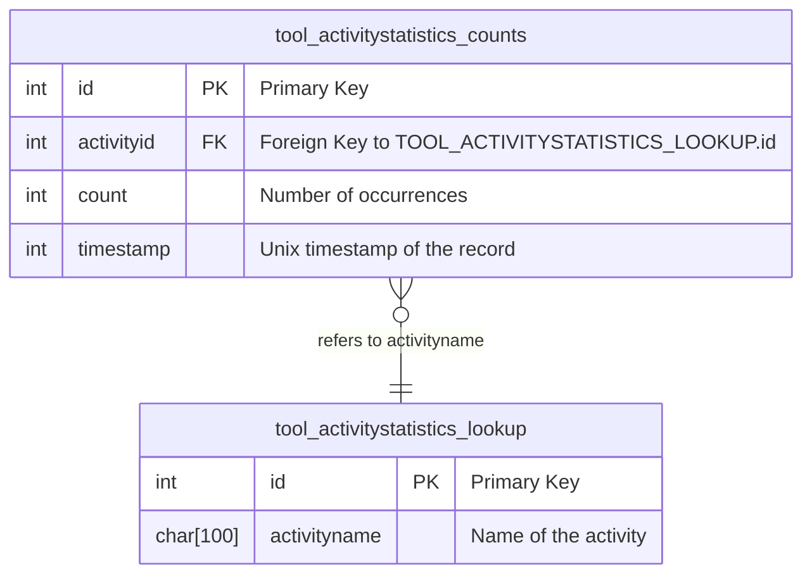

# Database Schema

```mermaid
erDiagram
    tool_activitystatistics_lookup {
        int id PK "Primary Key"
        char[100] activityname "Name of the activity"
    }

    tool_activitystatistics_counts {
        int id PK "Primary Key"
        int activityid FK "Foreign Key to TOOL_ACTIVITYSTATISTICS_LOOKUP.id"
        int count "Number of occurrences"
        int timestamp "Unix timestamp of the record"
    }

    tool_activitystatistics_counts }o--|| tool_activitystatistics_lookup : "refers to activityname"
```

