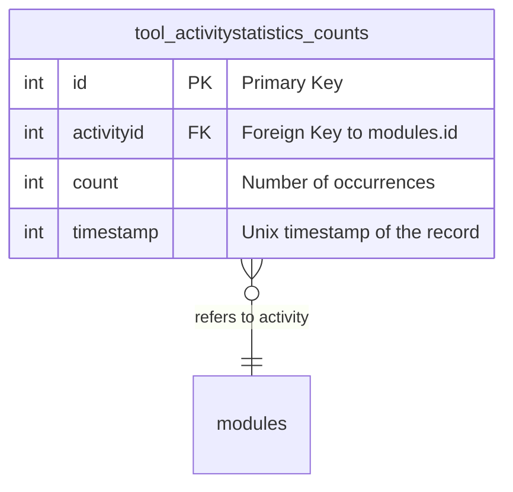

# Database Schema

```mermaid
erDiagram
    tool_activitystatistics_counts {
        int id PK "Primary Key"
        int activityid FK "Foreign Key to modules.id"
        int count "Number of occurrences"
        int timestamp "Unix timestamp of the record"
    }

    tool_activitystatistics_counts }o--|| modules : "refers to activity"
```
# TODO: Top/Flop Plugins der letzten Zeit (Delta)

# TODO: Balkendiagramm

# TODO: Doppelte Farben

# TODO: Zeitraum

# TODO: Tatsächliche Nutzung/ Zugriffe

