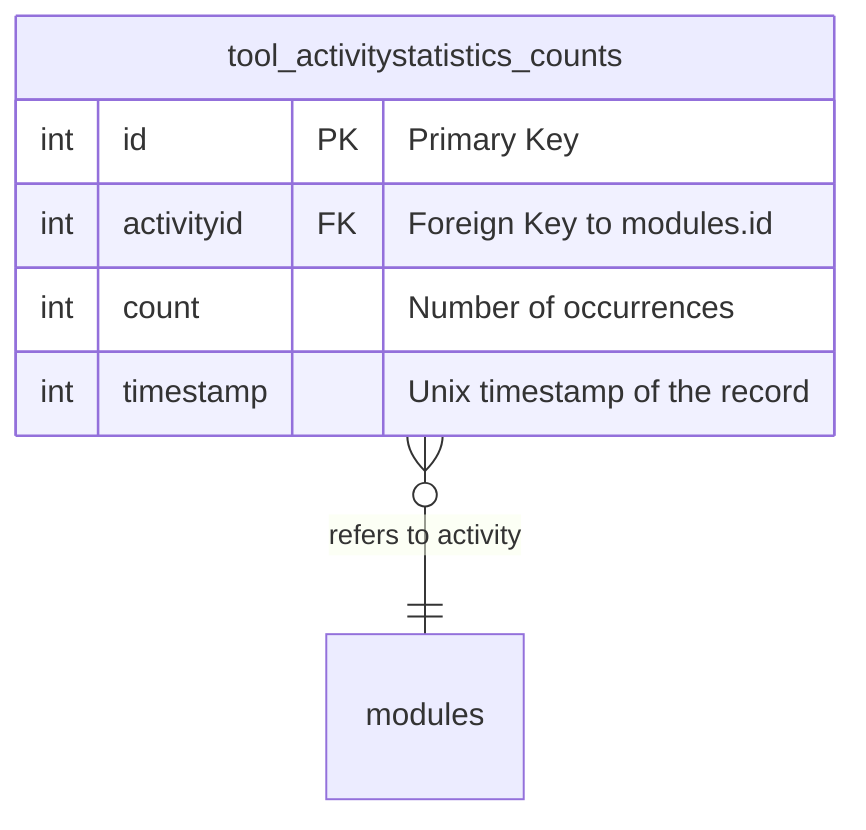
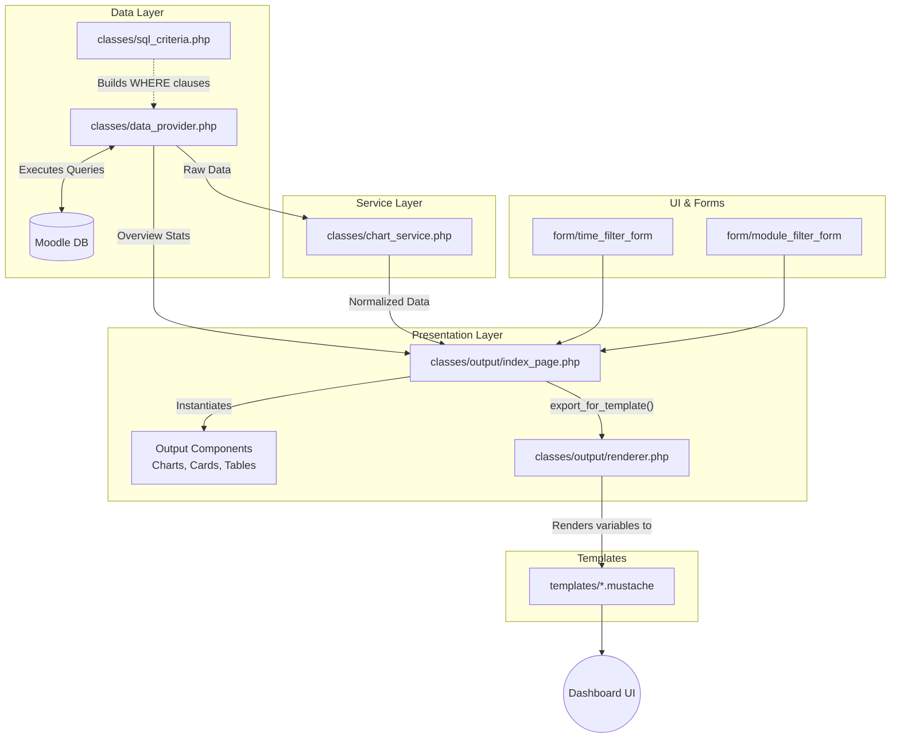
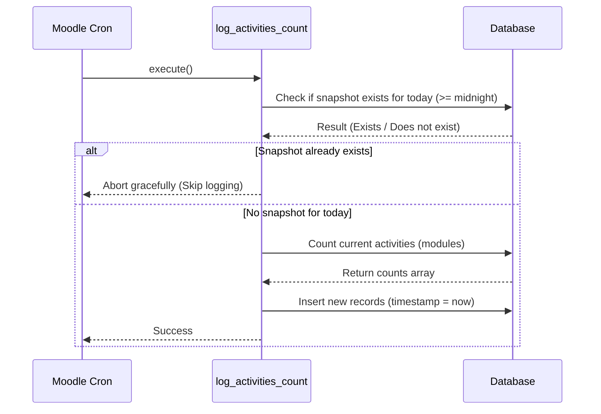

# Architecture of Activity Statistics (tool_activitystatistics)

This document outlines the software architecture, data flow, and key design decisions for the Activity Statistics plugin. The plugin strictly adheres to Moodle's MVC (Model-View-Controller) and Renderable/Templatable paradigms.

---

## 1. Database Schema

The plugin uses a minimalist, append-only data model to track historical metrics without impacting Moodle's core performance.

*   **`tool_activitystatistics_counts`**: Stores point-in-time snapshots of activity frequencies.
*   **Performance Note**: Aggregations rely on the `timestamp` field. Queries filter and group by this column heavily, making it a prime candidate for an index in Moodle's `install.xml`.

---

## 2. Component Architecture & Data Flow

The architecture strictly separates data extraction, business logic (normalization), and presentation.

### Layer Breakdown
*   **Data Provider**: Centralizes all database read operations. Implements fallback lookups (`get_fallback_total_count()`) to ensure timeline integrity when custom date ranges are queried.
*   **Chart Service**: Consumes raw data from the Data Provider. Normalizes all timestamps to midnight (`usergetmidnight()`) and injects fallback boundaries to prevent charts from rendering empty or disconnected lines.
*   **Renderable (index_page)**: Acts as the data bridge. It instantiates all charts and forms, injecting them into a single data array passed to the Mustache rendering engine.

---

## 3. Scheduled Task Execution (Data Collection)

To prevent database bloat, the scheduled task (`\tool_activitystatistics\task\log_activities_count`) features a built-in idempotency safeguard. It strictly allows only **one snapshot per day**, regardless of how often Moodle's cron triggers it.

---

## 4. Form and Filter State Management

The plugin maintains state seamlessly across two distinct `moodleform` instances without utilizing sessions.

1.  **Time Filter Form (`time_filter_form.php`)**: Controls the global time boundaries.
    *   *Auto-Submit*: Predefined intervals (e.g., "Last 30 days") trigger a JavaScript auto-submit.
    *   *State Retention*: Passes the current module filter selection back to itself via hidden variables (`_customdata`).
2.  **Module Filter Form (`module_filter_form.php`)**: Controls the multi-line chart display.
    *   *Dynamic Generation*: Automatically fetches all installed `mod_*` plugins to build checkboxes.
    *   *UI Override*: QuickForm `<legend>` elements are unset in PHP to maintain a clean typography scale in the Mustache templates.

All structural overrides for Moodle forms (e.g., forcing inline flexbox layouts) are localized in the plugin's `styles.css`.